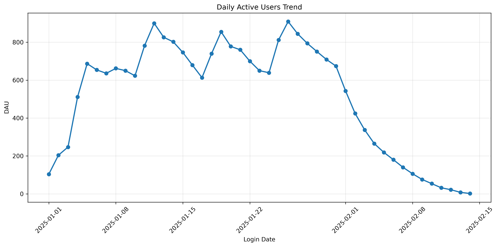
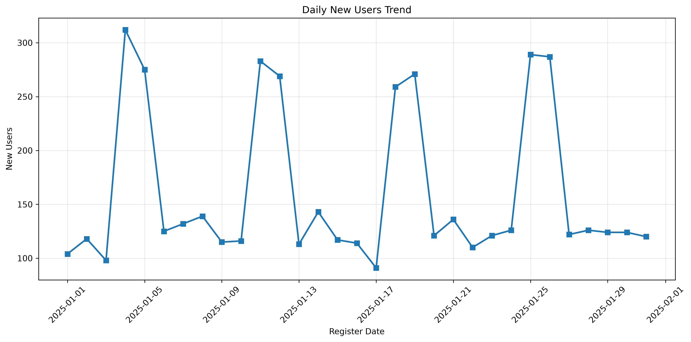

# 游戏用户留存分析（Game User Retention Analysis）
## 项目简介
本项目基于模拟游戏用户行为数据，使用 MySQL + Python（Pandas、Matplotlib）对游戏用户的登录、留存和付费行为进行分析，完成了从数据生成、数据清洗、SQL分析到可视化展示的完整数据分析流程。
项目模拟了真实互联网游戏的数据分析场景，重点分析了用户活跃情况、留存率及付费表现，为产品运营提供数据支持。
## 项目目标
本项目主要完成以下分析内容：
- 用户活跃分析（DAU）
- 新增用户分析（New Users）
- 用户留存分析（Day1、Day3、Day7）
- 每日收入分析（Revenue）
- 每日付费率分析（Payment Rate）
- ARPU 分析
- ARPPU 分析
- 数据可视化展示
## 技术栈
| 工具           | 用途           |
| ------------ | ------------ |
| Python       | 数据生成、数据分析    |
| Pandas       | 数据读取与统计分析    |
| Matplotlib   | 数据可视化        |
| MySQL        | 数据存储与 SQL 分析 |
| Navicat      | 数据库管理        |
| Git / GitHub | 项目管理         |
## 项目流程
```text
Python生成模拟数据
        │
        ▼
MySQL数据库导入
        │
        ▼
SQL数据清洗
        │
        ▼
SQL业务分析
        │
        ▼
Pandas数据读取
        │
        ▼
Matplotlib可视化
```
## 项目目录
```text
game-user-retention-analysis
│
├── data
├── images
├── python
├── report
├── sql
└── README.md
```
## 可视化结果
## 1、DAU趋势

## 2、新增用户趋势

## 3、用户留存率

## 4、每日收入趋势

## 5、每日付费率

## 6、ARPU
 
## 7、ARPPU

## 项目亮点
- 使用 Python 模拟生成游戏用户行为数据
- 使用 MySQL 完成数据清洗与业务分析
- 基于 SQL 计算 DAU、新增用户、用户留存率等核心运营指标
- 使用 Pandas 对 SQL 查询结果进行进一步统计分析
- 使用 Matplotlib 绘制业务趋势图，直观展示分析结果
- 完整体验数据分析项目从数据准备到可视化展示的全过程
## 项目总结
通过本项目，掌握了游戏数据分析的基本流程，能够独立完成数据清洗、业务指标分析及数据可视化工作，并对互联网产品中常见的用户增长、用户留存及付费分析有了更深入的理解。
